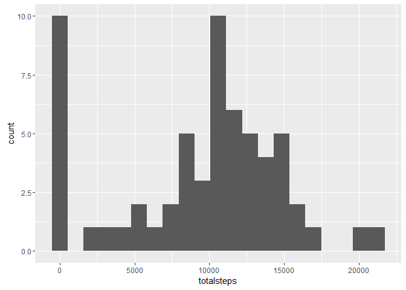
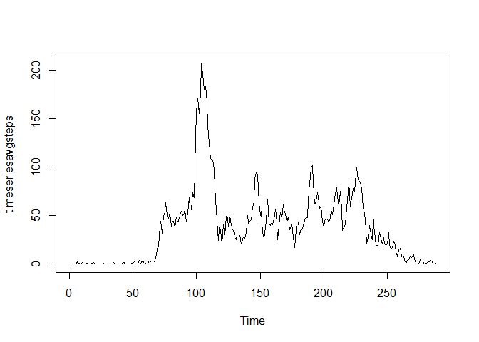
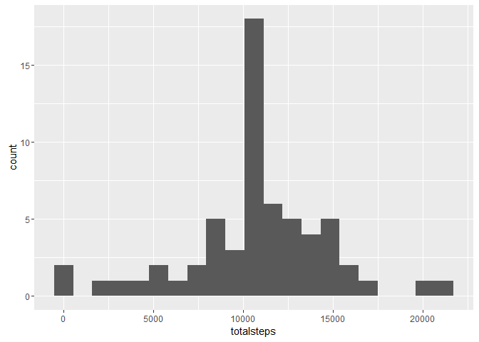
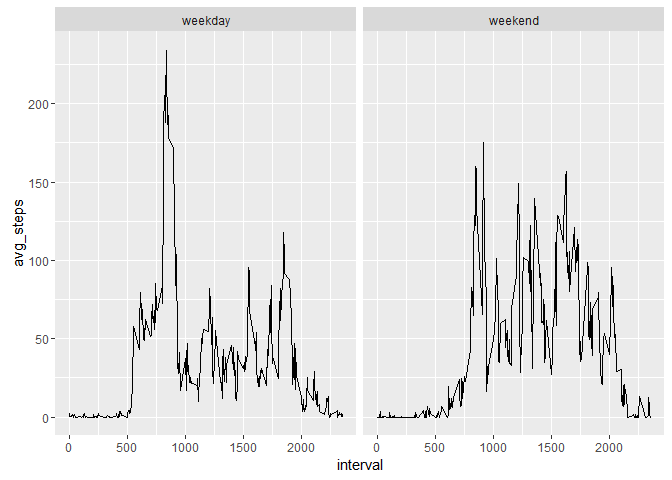

# Reproducible Research: Peer Assessment 1
## Loading and preprocessing the data


Code for reading in the dataset and/or processing the data


```r
setwd("C:/Users/laura/Dropbox/Training/Coursera/RDataScience/Course5ReproducibleResearch/")

#load the data
activity<-read.csv('activity.csv')

#load graphing package
library("ggplot2")
library("dplyr")
```

```
## 
## Attaching package: 'dplyr'
```

```
## The following objects are masked from 'package:stats':
## 
##     filter, lag
```

```
## The following objects are masked from 'package:base':
## 
##     intersect, setdiff, setequal, union
```
## What is mean total number of steps taken per day?

Histogram of the total number of steps taken each day

```r
#Sum step data by total number of steps taken each day
dailyactivity<-activity%>%group_by(date)%>%summarise(totalsteps=sum(steps,na.rm=TRUE))
qplot(totalsteps,data=dailyactivity,binwidth=21200/20)
```

<!-- -->

Mean and median number of steps taken each day


```r
mediandailysteps<-median(dailyactivity$totalsteps)
print(paste("Median daily steps:",mediandailysteps))
```

```
## [1] "Median daily steps: 10395"
```

```r
meandailysteps<-mean(dailyactivity$totalsteps)
print(paste("Mean daily steps:",meandailysteps))
```

```
## [1] "Mean daily steps: 9354.22950819672"
```
## What is the average daily activity pattern?

Time series plot of the average number of steps taken


```r
averagesteps<-activity%>%group_by(interval)%>%summarise(averagesteps=mean(steps,na.rm=TRUE))
timeseriesavgsteps<-ts(averagesteps$averagesteps)
plot.ts(timeseriesavgsteps)
```

<!-- -->

The 5-minute interval that, on average, contains the maximum number of steps


```r
print(paste("The maximum average steps occurred in the following interval:",averagesteps[which(averagesteps$averagesteps==max(averagesteps$averagesteps)),]))
```

```
## [1] "The maximum average steps occurred in the following interval: 835"             
## [2] "The maximum average steps occurred in the following interval: 206.169811320755"
```
## Imputing missing values

Code to describe and show a strategy for imputing missing data


```r
print(paste("There are",nrow(activity[is.na(activity$steps),]),"records with missing data"))
```

```
## [1] "There are 2304 records with missing data"
```

```r
imputedactivity<-activity %>% group_by( interval ) %>%transform(steps = ifelse(is.na(steps), mean(steps, na.rm = TRUE), steps))
dailyactivityimpute<-imputedactivity%>%group_by(date)%>%summarise(totalsteps=sum(steps,na.rm=TRUE))
```

The data was imputed with the average steps for each interval.

Histogram of the total number of steps taken each day after missing values are imputed


```r
qplot(totalsteps,data=dailyactivityimpute,binwidth=21200/20)
```

<!-- -->

```r
mediandailystepsimpute<-median(dailyactivityimpute$totalsteps)
print(paste("Median daily steps after impute:",mediandailystepsimpute))
```

```
## [1] "Median daily steps after impute: 10766.1886792453"
```

```r
meandailystepsimpute<-mean(dailyactivityimpute$totalsteps)
print(paste("Mean daily steps  after impute:",meandailystepsimpute))
```

```
## [1] "Mean daily steps  after impute: 10766.1886792453"
```

## Are there differences in activity patterns between weekdays and weekends?

Panel plot comparing the average number of steps taken per 5-minute interval across weekdays and weekends


```r
activitywweekdays<-activity%>%mutate(weekday=weekdays(as.Date(date,"%Y-%m-%d")))
weekdaytable<-data.frame(weekday=c("Monday","Tuesday","Wednesday","Thursday","Friday","Saturday","Sunday"),weekend=c("weekday","weekday","weekday","weekday","weekday","weekend","weekend"))
activitywweekdays<-merge(activitywweekdays,weekdaytable, by="weekday")
avgweekendactivity<-activitywweekdays%>%group_by(weekend,interval)%>%summarise(avg_steps=mean(steps,na.rm=TRUE))
ggplot(avgweekendactivity,aes(x=interval,y=avg_steps))+geom_line()+facet_wrap(~weekend)
```

<!-- -->
